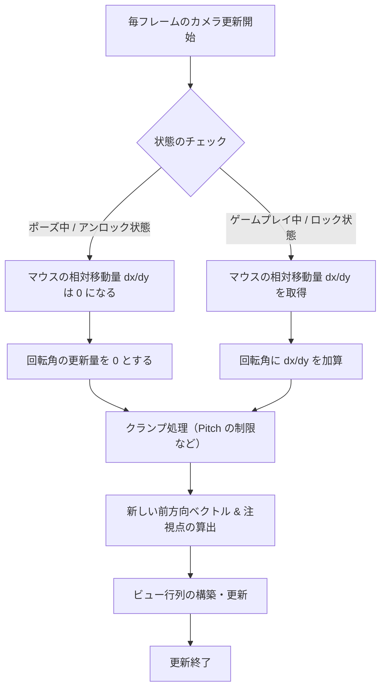

# マウスとカメラの理想的な実装フロー

3D（特に FPS / TPS カメラ操作）における、マウス制御とカメラ動作の設計および実装フローです。  
本プロジェクトでは `framework/mouse.h` / `mouse.cpp` と、`framework/camera.h` または `debugscene/debugcamera.h` がこの方針に準拠しています。

---

## 1. 設計思想 ― 絶対座標と相対座標の明確な分離

マウスの入力データは、**使用目的によって必要な性質が根本的に異なります**。

| 用途 | 必要なデータ | 望ましい挙動 |
| :--- | :---: | :--- |
| UI操作（ボタンホバー・クリックなど） | **絶対座標**（ウィンドウ内のピクセル位置） | カーソルが画面内を自由に動く |
| カメラ操作（視点回転など） | **相対移動量**（デルタ） | 端で止まらず無限回転。カーソルは中央ロック・非表示 |

> [!WARNING]
> これらを単一の `x`/`y` で使い回すと、モード変更時に入力の誤認や蓄積が発生し、**カメラが吹き飛ぶ・高速回転する・UIが動かなくなる**原因になります。

**推奨**: `Mouse_State` で **絶対座標 (`x`/`y`)** と **相対移動量 (`dx`/`dy`)** を独立定義する（現行実装済み）。

---

## 2. マウスモジュールの実装フロー

### ① 初期化（Initialize）

- 生入力（Raw Input）を登録
- 初期モードは通常 **絶対座標モード（`MOUSE_POSITION_MODE_ABSOLUTE`）**

### ② モード遷移制御（SetMode / LockMouse / UnLockMouse）

**相対座標モード（ロック時）**

```
ShowCursor(FALSE)
ClipCursor(rect) または中央引き戻し
→ Raw Input で dx/dy を蓄積
```

**絶対座標モード（アンロック時）**

```
ClipCursor(nullptr)
ShowCursor(TRUE)
dx = dy = 0   // ★相対移動量を強制リセット（重要）
```

### ③ 毎フレームの更新（ProcessMessage）

| モード | `x`, `y` | `dx`, `dy` |
| :--- | :--- | :--- |
| **絶対座標** | `WM_MOUSEMOVE` の座標 | 常に `0` |
| **相対座標** | `0` または無効値 | Raw Input のデルタ。読み取り後リセット |

`main.cpp` の `WndProc` から `Mouse_ProcessMessage` を呼ぶ。

---

## 3. カメラ制御の実装フロー



### 更新処理の要点

```cpp
Mouse_GetState(&state);
yaw   += state.dx * sensitivity;
pitch += state.dy * sensitivity;
// Camera: define.h の PITCH_LIMIT_* でクランプ
// DebugCamera: 適宜 ±89° 等でクランプ
```

アンロック時にマウス側が `dx = dy = 0` を保証していれば、カメラ側は加算だけで安全。

---

## 4. ロック・アンロックのシーケンス

### ゲームプレイ → UI（アンロック）

```
1. ポーズ / UI 状態へ切替
2. UnLockMouse()
   ├─ カーソル表示
   ├─ 絶対座標モード
   └─ ★ dx, dy = 0
3. ClickFont 等は x, y でヒット判定
```

### UI → ゲームプレイ（ロック）

```
1. UI を閉じる
2. LockMouse()
   ├─ カーソル非表示
   ├─ 相対座標モード
   └─ （推奨）SkipNextInput(1〜2) で移行直後の大デルタを捨てる
3. カメラが dx, dy で視点移動を再開
```

デバッグシーンでは Esc で `UnLockMouse()`（`debugscene.cpp`）。

---

## まとめ

| 観点 | 内容 |
| :--- | :--- |
| **データ構造の分離** | `Mouse_State` に `x`/`y` と `dx`/`dy` を独立定義 |
| **カプセル化** | 絶対座標モード中は相対移動量を `0` にする責任をマウス側が持つ |
| **呼び出し側** | `Camera` / `DebugCamera` は `dx`/`dy` を加算するだけでよい |

この設計を維持すれば、新しいカメラ種を追加しても同様の不具合を防げる。
