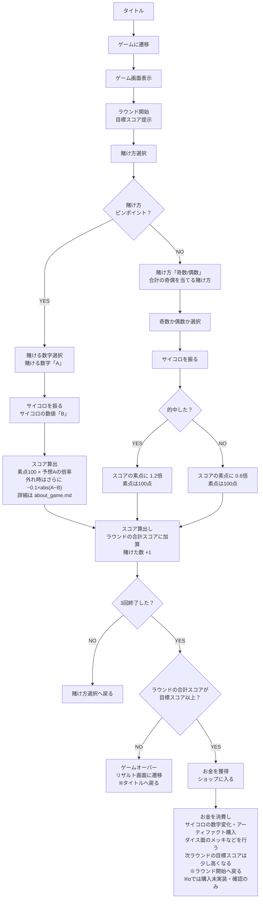

# MustDice フローチャート

元図: [`kaihatsu_resorce/mustdiceフローチャート.png`](../kaihatsu_resorce/mustdiceフローチャート.png)

倍率・素点・外れ計算の詳細は [about_game.md](about_game.md) を正とする。

配置の目安（元図どおり）:
- 左列: ピンポイント（YES）
- 右列: 奇数/偶数（NO）
- 中央下で両枝が合流 → ラウンド判定 → ショップ / ゲームオーバー
- 上へ戻る矢印はレイアウトを崩すため、戻り先をノード文言で示す

