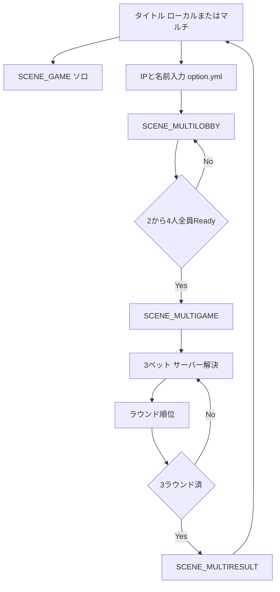
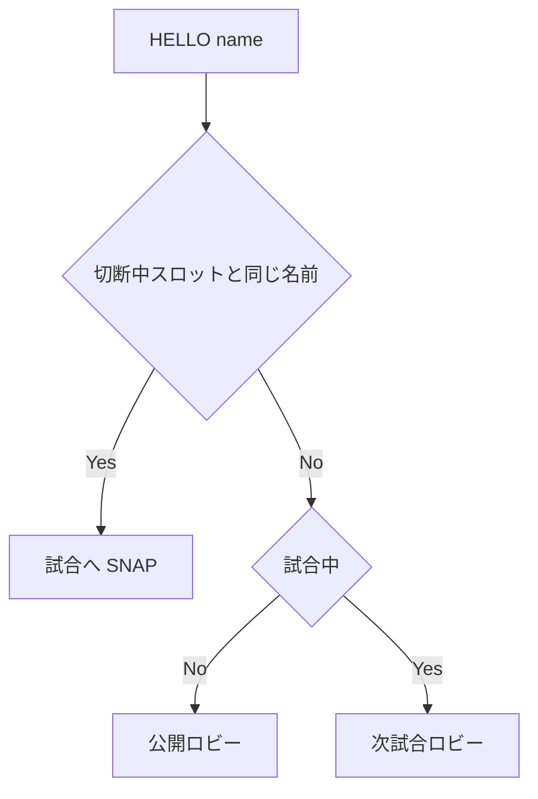

# MustDice マルチ対戦

ソロ（`SCENE_GAME`）とは別系統。サーバーなしでもタイトルからローカルプレイできる。

## 起動（VPS / Linux）

作業ディレクトリ・tmux・管理画面・ポートは [server.md](server.md)。クライアント用の本番 IP はこの文書に書かない。

試合サーバーは `0.0.0.0:7777`。プレイヤー側のポート開放は不要。

## クライアント

タイトルでローカル / マルチを選ぶ。マルチ時はホスト（IPv4 またはドメイン）と名前を入力し、実行ディレクトリの `option.yml` に保存する。接続（名前解決を含む）はバックグラウンドで行い、入力中にゲームループは止めない。

```yaml
server_ip: （各自入力）
server_port: 7777
player_name: Player
```

シーン: `SCENE_MULTILOBBY` → `SCENE_MULTIGAME` → `SCENE_MULTIRESULT` → タイトル。`game.cpp` / ソロ `SCENE_RESULT` / ショップは使わない。

## 試合ルール

- 2〜4人。公開ロビーにいる全員が Ready で開始（人間1人以上かつ合計2人以上）。4人未満のときは `FILLBOTS` で Bot を足して4人にできる
- 3ラウンド、1ラウンド3ベット
- A役・B役の得点はソロと同じ（`bet_logic`）。出目はベットごとにサーバーが 1 回だけ 2d6 し、全員が同じ出目を見る
- 制限時間 18 秒。未提出は B役ランダム。切断中も自動選択で継続。ただし全員が切断したら試合は破棄し待ち受け（公開ロビー）へ戻す
- 順位ポイント（`matchPointX100`）: 2人なら 400/300、3人なら 400/300/200、4人なら 400/300/200/100。同点は占有スロット合計を等分
- 最終同点: 1位回数（タイ1位は全員+1）→ 累計 roundScore → 同率
- 同時試合は1つ。試合中の新規は次試合ロビー（最大4、超過は FIFO）。再接続は同じ名前の切断スロットのみ
- 試合後はタイトルへ。自動では次ロビーに戻さない
- ショップ・HP・観戦は後回し

## フロー



試合中の接続:



## プロトコル（TCP・1行・UTF-8）

クライアント: `HELLO name` / `READY` / `FILLBOTS` / `BET P 2-12` / `BET O 1|0`

サーバー: `WELCOME` `LOBBY` `MATCH_START` `BET_OPEN round bet remainSec` `BET_WAIT` `RESOLVE` `ROUND_END` `MATCH_END` `SNAP` `ERR`

`RESOLVE` の出目はベット共通。クライアントはセッションの `die0`/`die1` で同じロールを表示する。

名前に空白は不可。接続中の重複名は `ERR NAME`。

## サーバー権威

出目・得点・順位はサーバーだけが確定する。クライアントは選択の送信と表示。
