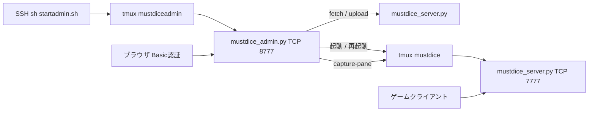

# MustDice サーバー構成と管理画面

クライアント向けの試合ルール・プロトコルは [multiplayer.md](multiplayer.md)。本番の接続先 IP はここに書かない。

## VPS 本体を触れない人へ

SSH や作業ディレクトリに入れない場合、やることは **ブラウザの管理画面だけ** で足りる。試合ロジックのファイルを VPS 上で直接編集する必要はない。試合サーバーの起動もブラウザから行う。

いまの構成では次の2つが分かれている。

| 層 | 何か | 触れない人がやること |
| --- | --- | --- |
| 管理画面 | `mustdice_admin.py`（常時起動の Web） | ブラウザでログを見る。ボタンで GitHub 取得・起動／再起動・アップロード |
| 試合ロジック | `mustdice_server.py` | 本リポジトリへ直接 push できない人は、管理画面からファイルをアップロードする |

流れはこうなる。

1. ディスク上の本体を更新する（どちらか。初回は必須）
   - **GitHubの最新を取得**（`master` の `mustdice_server.py`）
   - **アップロード**（手元の `mustdice_server.py`。PR なしで VPS だけ差し替えられる）
2. 管理画面で **起動 / 再起動**（ディスク上の本体で試合プロセスを作り直す。接続中の試合は切れる）

アップロードや GitHub 取得はディスクだけ更新する。動いている試合はそのまま。反映するには起動／再起動が必要。アップロードした本体は GitHub の `master` と違うことがある。

管理画面のプロセスと、試合サーバーのプロセスは別。試合を再起動しても管理画面は落ちない。管理画面そのものを更新したいときだけ、VPS に入れる人が `startadmin.sh` と `mustdice_admin.py` を手で置き直す。

URL、ユーザー名、パスワードは開発Discordに記載。

以下は VPS に入れる人向けの構成・起動手順。

---

## 全体像

ゲーム本体と管理サイトは別プロセス・別 tmux・別ポート。試合の取得・起動は管理サイトだけが行う。



| 役割 | プロセス | tmux | ポート |
| --- | --- | --- | --- |
| 試合サーバー | `mustdice_server.py` | `mustdice` | TCP 7777 |
| 管理サイト | `mustdice_admin.py` | `mustdiceadmin` | TCP 8777 |

VPS で 7777 と 8777 を開ける。プレイヤー側のポート開放は不要。

## 作業ディレクトリ

手置きは次の2つだけ。試合本体はブラウザから取る。

```text
~/mustdiceserver/
  startadmin.sh         # 手置き
  mustdice_admin.py     # 手置き
  mustdice_server.py    # 管理画面の GitHub 取得またはアップロードで作られる
```

手置きファイルは CRLF が残ると壊れる。`sed -i 's/\r$//' *.py *.sh`。直接 `./startadmin.sh` で起動しない（shebang の `\r`）。`sh startadmin.sh` を使う。

GitHub 取得元（認証なし）:

`https://raw.githubusercontent.com/realryo1/MustDice/master/server/mustdice_server.py`

## ファイルの役割

| ファイル | 役割 |
| --- | --- |
| [`mustdice_server.py`](../server/mustdice_server.py) | 試合の TCP サーバー。出目・得点・順位の権威。stdlib asyncio |
| [`mustdice_admin.py`](../server/mustdice_admin.py) | GitHub 取得・アップロード・試合起動・ログの HTTP。stdlib `http.server` |
| [`startadmin.sh`](../server/startadmin.sh) | 管理サイトを tmux `mustdiceadmin` で起動する |

## 管理画面

常時起動前提。試合の再起動では落ちない（別 tmux）。VPS 再起動後は管理サイトを手で上げ直し、ブラウザから試合を起動する。

### 起動（SSH でやるのはこれだけ）

```text
cd ~/mustdiceserver
sh startadmin.sh
```

既存の `mustdiceadmin` があれば作り直してアタッチする。ゲーム用 `mustdice` の中で実行すると拒否する。tmux が無ければ今のシェルで `mustdice_admin.py` を起動する。試合用 tmux が既にいると、新しいセッションは同じ tmux サーバー上に作られる。そのときシェルの `export` は届かないので、`startadmin.sh` は `env` で認証用変数を渡す。Python がすぐ終了した場合はペインを閉じず、終了コードを出したあとシェルを残す。

- 抜ける: `Ctrl+B` のあと `D`
- 戻る: `tmux attach -t mustdiceadmin`

試合サーバーのログを SSH で見るとき: `tmux attach -t mustdice`

### 認証と URL

ブラウザ: `http://（VPSのホスト）:8777/`

HTTP Basic。

| 環境変数 | 省略時 | 意味 |
| --- | --- | --- |
| `MUSTDICE_ADMIN_USER` | `admin` | ユーザー名 |
| `MUSTDICE_ADMIN_PASS` | （空） | パスワード |
| `MUSTDICE_ADMIN_PORT` | `8777` | 待ち受けポート |

`startadmin.sh` がこれらの値を export してから Python を起動する。スクリプト内の `export` を書き換えるか、起動前に export すれば認証を変えられる。空パスワードは許可している。

### 画面の使い方

ログイン後は1ページ。

- 状態: tmux `mustdice` がいるかどうか
- ログ: `tmux capture-pane -t mustdice` を数秒ごとに更新
- **GitHubの最新を取得**: `master` の `mustdice_server.py` を作業 dir に保存（試合は止めない）
- **起動 / 再起動**: ディスク上の本体で試合サーバーを detached で作り直す。接続中の試合は切れる。GitHub は取り直さない。本体がまだ無いときは失敗する
- **アップロード**: 手元の `mustdice_server.py` を作業 dir に保存（試合は止めない。ファイル名が `mustdice_server.py` でないもの、`def score_pinpoint` が無いものは拒否）

試合サーバーが止まっているときはログ欄にその旨が出る。管理サイト自身の再起動は `sh startadmin.sh`（SSH）で行う。

## やってはいけないこと

- 管理サイトを tmux `mustdice` の中で起動する
- SSH から `python3 mustdice_server.py` を直接起動する（起動は管理画面のボタンだけ）
- 管理サイトからゲーム本体と同じポート 7777 を使う
